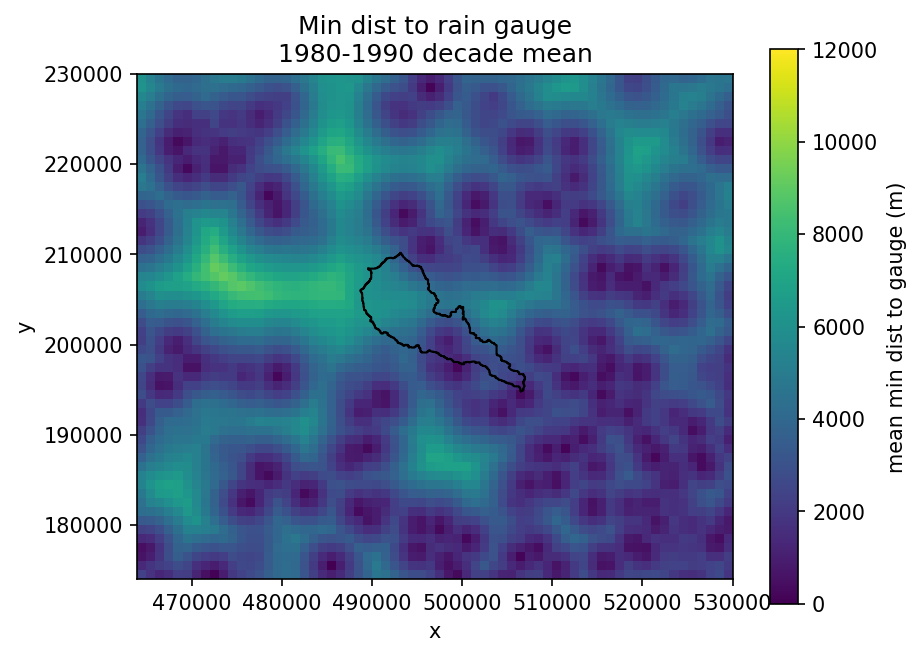
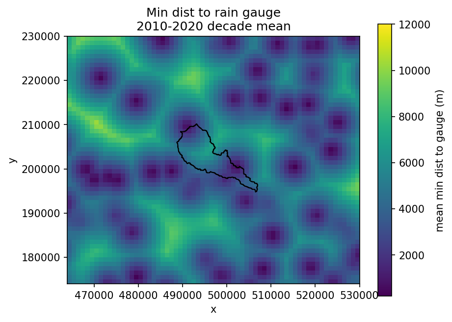
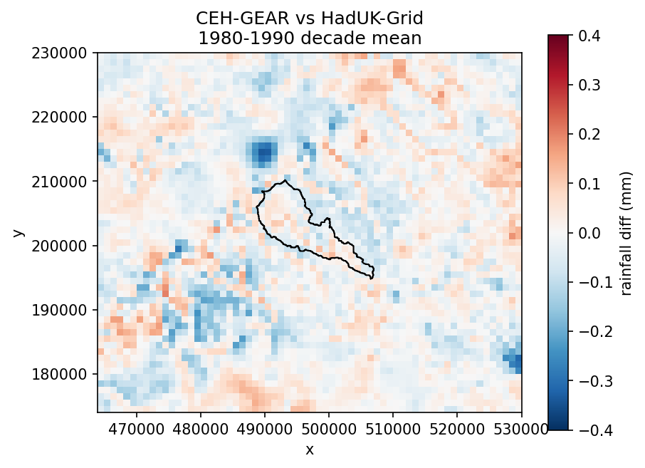
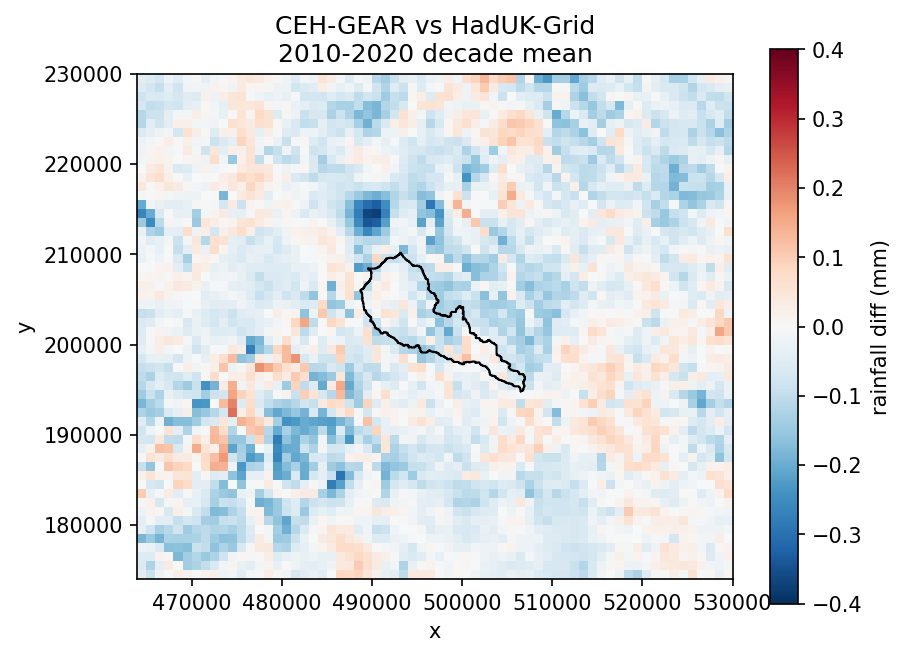

# Rain gauges near River Chess
Notebook to explore rain gauges around River Chess. 

## View rain gauges on random days

### Compare minimum distance to nearest gauge decadal means
There are were more rain gauges on average across the catchment during the 1980s compared with the 2010s.  
Below we compare the decadal mean distance to nearest gauge:  

### Compare CEH-GEAR vs HadUK-Grid Bias around Chess
  

  
 
 **Difference between two decade mean**  
 