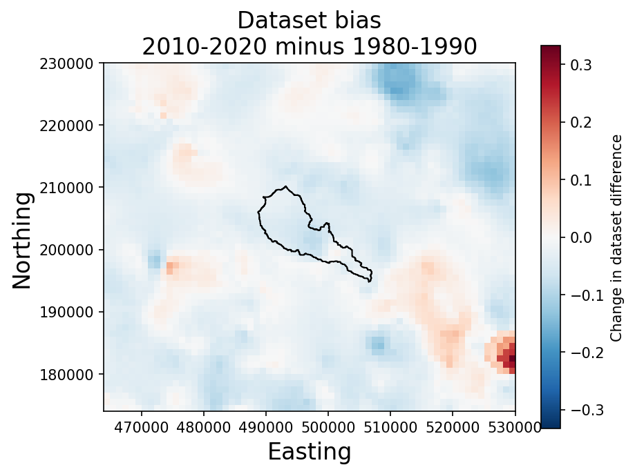

# Rain gauges near River Chess
Notebook to explore rain gauges around River Chess.  
If you would like access to the datasets I used for this (about 3 GB total), please email me.

## View rain gauges on select days
The amount of rain gauges has decreased across the Chess catchment in most region except over the north-east.  
  
In the below figures, rain gauges are represented by:  
- *Red circles* - when gauge is used in daily data only  
- *Yellow circles* -when gauge is used in monthly and daily data  

*no monthly only rain gauges were found in this region*  

### Compare minimum distance to nearest gauge (decadal means)
There were more rain gauges on average across the catchment during the 1980s compared with the 2010s.  
Below we compare the decadal mean distance to nearest gauge:  

### Compare CEH-GEAR vs HadUK-Grid Bias around Chess (decadal means)
Next, we examine the differences between the CEH-GEAR and the HadUK-Grid (red means CEH bias, and blue means HadUK bias).  

  

  
 
 **Difference between two decade means**  
Across most of the catchment the difference between the two datasets (here bias) has increased towards HadUK-Grid bias.  
One exception is in the south east of the study region (where CEH bias has grown).   
Potentially, a rain gauge was added towards the south-east that has only been included in the CEH-GEAR?  
 